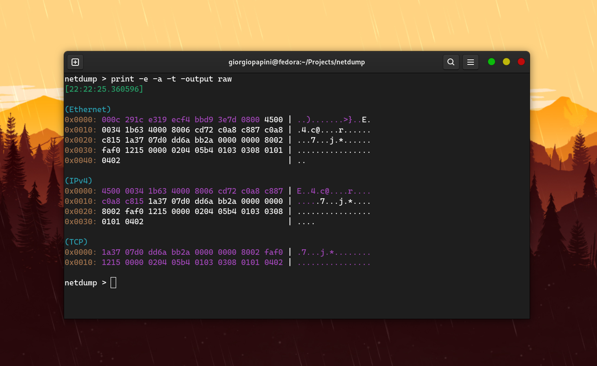

## What is netdump?
Based on libpcap and completely built in C, netdump is a free and open-source network protocol analizer.
netdump is designed to cater to users with varying levels of expertise and backgrounds. It achieves this by providing an easy-to-use CLI tool, along with a straightforward netdump-devel package. This setup is ideal for users who need to analyze industry-specific protocols, those interested in building their own dissector implementations, and also for people who simply want to scan a network or a .pcap file.

Disclaimer: netdump is entirely independent and unrelated to any other programs named "netdump" or similar.

## Installation
netdump can be executed on the vast majority of Linux machines. It can be installed manually using make, or installed by using a package manager (RPM on Fedora, CentOS and RHEL).
You can install netdump in several ways depending on your goal:

1) Clone the repo and compile the program using ```make```.
2) Clone the repo and install the program inside ```/usr/local/bin``` by running ```sudo make install```.
3) Install the program inside ```/usr/bin``` by using a package manager.

## Running netdump
There are several methods to execute netdump based upon the installation process you chose:

1) Execute ```make run``` or ```sudo ./netdump``` if you just compiled the program using ```make```.
2) Execute ```sudo /usr/local/bin/netdump``` if you installed the program using ```sudo make install```.
3) Execute ```sudo netdump``` if you installed it using a package manager.

## Remove netdump
You can remove netdump from your system in several ways:

1) Execute ```sudo make remove``` if you previously installed netdump using ```sudo make install```
2) Uninstall netdump using the package manager you used to install it.

## Netdump commands
The general command format is this ```netdump <command> -<arg_1> <value_1> ... -<arg_n> <value_n>```.
Run the ```help``` command from anywhere inside the CLI tool to get a small doc about every command and its supported arguments.
Strings should be enclosed in "" to prevent netdump from misinterpreting uppercase letters, -, and other symbols.

### ```analize```
This command is used to scan incoming and outgoing network traffic for a selected device.
The following table lists the allowed arguments for this command.

| Arg | Value | Description |
|--------|------------|---------|
| `-n` | int | Set a packet scanning limit |
| `-filter` | str | Filter packets (based upon libpcap's filter function) |
| `-dev` | str | Select an avaliable device for scanning network traffic |
| `-e` | none | Show datalink layer protocol header |
| `-nnet` | none | Don't show network layer protocol header |
| `-t` | none | Show transport layer protocol header |
| `-a` | none | Show application layer protocol header |
| `-nprom` | none | Turn off libpcap promiscuos mode |
| `-ntime` | none | Hide timestamp |
| `-npname` | none | Hide protocol name in the output |
| `-#` | none | Show packet number |
| `-r` | str | Read a .pcap file |
| `-w` | str | Write a .pcap file with all the scanned packets |

### ```print```
This command is used to display detailed informations for a specific packet.
The following table lists the allowed arguments for this command.

| Arg | Value | Description |
|--------|------------|---------|
| `-n` | int | Choose a packet by its scanning order number |
| `-e` | none | Show datalink layer protocol header |
| `-nnet` | none | Don't show network layer protocol header |
| `-t` | none | Show transport layer protocol header |
| `-a` | none | Show application layer protocol header |
| `-ntime` | none | Hide timestamp |
| `-npname` | none | Hide protocol name in the output |
| `-output` | (std, raw, art) | Select output format |
| `-#` | none | Show packet number |

### ```dissectors```
This command is used to manage custom dissectors.
The following table lists the allowed arguments for this command.

| Arg | Value | Description |
|--------|------------|---------|
| `-list` | none | Show custom dissectors list |
| `-add` | str | Add custom dissector |
| `-on` | str | Activate custom dissector (empty = all) |
| `-off` | str | Deactivate custom dissector (empty = all) |
| `-delete` | str | Delete a custom dissector (delete file) |

### ```save```
This command is used to save scanned packets to a .pcap file.
The following table lists the allowed arguments for this command.

| Arg | Value | Description |
|--------|------------|---------|
| `-to` | str | Specify the destination file for saving scanned data |
| `-n` | int | Choose the single packet to save by its scanning order number |

### ```reset```
This command is used to reset stored packets.

### ```devlist```
This command is used to retrieve a list of all available devices for scanning.

### ```clear```
This command is used to clear screen output.

### ```exit```
This command is used to exit program.


## Adding custom dissectors
To create a custom dissector, refer to the ```netdump-devel``` repo (https://github.com/giorgiopapini/netdump-devel).
The ```netdump-devel``` package allows you to compile your custom dissector as a shared library. Once compiled as a .so file, you can add it to netdump using the following command:
```netdump dissectors -add "path-to-dissector.so"```
This will place the dissector in the ```~.local/lib/netdump/custom_dissectors/``` directory. Once added, your dissector will be correctly loaded into the netdump program.

## Benchmark
I compared netdump with tcpdump in terms of speed, and these are the results I obtained (I disabled hostname resolution in tcpdump to make it faster).
The following are some of the comparisons I made. For others, check the assets folder.

<p float="left">
  
  
</p>
<p float="left">
  
  
</p>
<p float="left">
  
  
</p>

However, the problem is that netdump does not support the extensive range of protocols that tcpdump does. Therefore, I focused on measuring TCP packets by adding "dummy" protocol handlers to the proto_tables that netdump traverses while dissecting a TCP packet. I placed the TCP, IPv4, and Ethernet protocols at the end of their respective proto_tables to simulate the worst-case scenario.
The result is still amazing.
[Watch the video](./assets/netdump_benchmark.mp4)

## Screenshots




